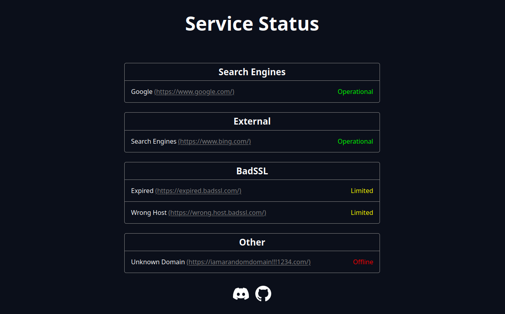
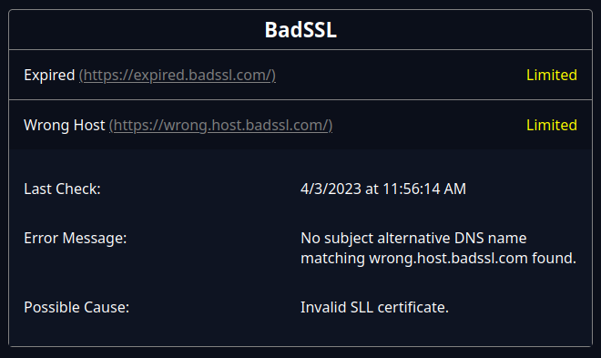

# PagePulse
A simple self-hosted status page that allows you to check the availability of your website, application or service. 
As long as its reachable using HTTP/HTTPS its supported.
The app also allows you to connect to databases using JDBC. 
By default it will create a SQLite database.

I personally deploy it in on one of my cloud servers and let it monitor the status of my applications: https://status.parzival.space/

## Features
* Easily check the status of your website, application or service
* Simple and easy to use interface
* Easy to deploy and self-host
* Social connections (Currently only Discord and GitHub)

## Getting Started
To get started with PagePulse, please refer to the [Installation](https://github.com/parzival-space/pagepulse/wiki/Installation) section of the Wiki.
You will find detailed instructions on how to use this software.

## Contributing
Do you want to improve PagePulse?
You are more than welcome to contribute to this project. 

To contribute, please follow these steps:
1. [Fork the Repository](https://github.com/parzival-space/pagepulse/fork)
2. Create a branch with a descriptive name for your feature or bugfix (ex: feature/super-cool-feature)
3. If your code is not already covered by the unit tests, it would be nice if you could write some for it
4. Submit a pull request
5. Profit!

## Screenshots

Status overview.

Service details.

## License
Distributed under the GNU GPL-3.0 license. See ``LICENSE`` for more information.